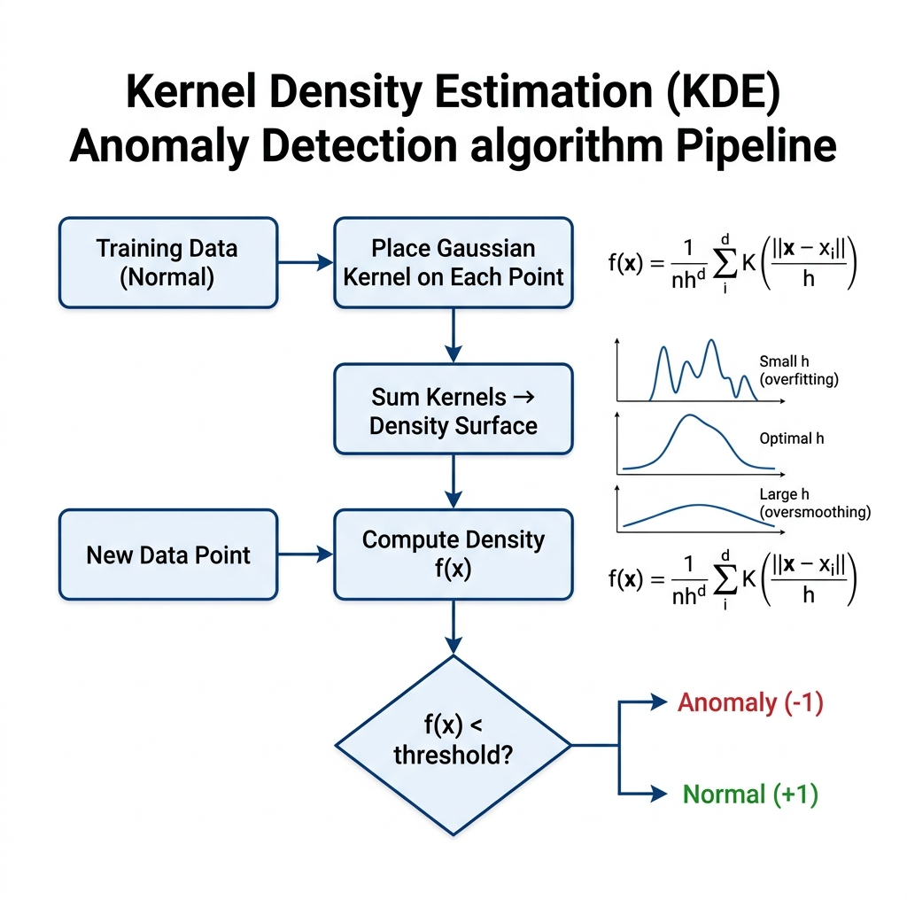

# Kernel Density Estimation (KDE) for Anomaly Detection

## 1. Introduction

Kernel Density Estimation is a non-parametric method used to estimate the probability density function (PDF) of a random variable. In anomaly detection, KDE identifies outliers as data points that fall in regions of **low estimated density** — the fundamental idea being that normal data concentrates in high-density regions, while anomalies reside where data is sparse.

**Real-World Analogy:** Imagine a heat-map of footsteps in a shopping mall. Areas near popular stores glow bright (high density), while a lone footstep in a restricted corridor stands out — that is your anomaly.

---

## 2. Intuition

KDE places a smooth "bump" (kernel) on every observed data point and sums them up to construct a continuous density surface. Points that sit in valleys of this surface — far from the crowd — receive low density scores and are flagged as anomalies. Unlike parametric methods (e.g., Gaussian assumption), KDE makes **no assumption about the underlying distribution shape**, making it highly flexible.

---

## 3. Mathematical Formulation

The multivariate KDE at a point **x** is:

$$\hat{f}(\mathbf{x}) = \frac{1}{n \cdot h^d} \sum_{i=1}^{n} K\!\left(\frac{\|\mathbf{x} - \mathbf{x}_i\|}{h}\right)$$

| Symbol | Meaning |
|--------|---------|
| $n$ | Number of training samples |
| $d$ | Number of features (dimensions) |
| $h$ | Bandwidth — controls smoothness of the density estimate |
| $K(\cdot)$ | Kernel function (commonly Gaussian) |
| $\mathbf{x}_i$ | The i-th training data point |

**Gaussian Kernel:**

$$K(u) = \frac{1}{\sqrt{2\pi}} \exp\!\left(-\frac{u^2}{2}\right)$$

**Silverman's Rule of Thumb (bandwidth selection):**

$$h = \left(\frac{4\hat{\sigma}^5}{3n}\right)^{1/5} \approx 1.06 \cdot \hat{\sigma} \cdot n^{-1/5}$$

The bandwidth $h$ is the single most important hyperparameter: too small → overfitting (spiky density); too large → oversmoothing (miss anomalies).

---

## 4. How It Works — Step by Step

1. **Receive training data** — a set of $n$ observations assumed mostly normal.
2. **Choose kernel and bandwidth** — Gaussian kernel + Silverman's rule is a strong default.
3. **Estimate density at each point** — place a kernel on every training point, sum contributions.
4. **Score new points** — compute $\hat{f}(\mathbf{x})$ for each test point.
5. **Apply threshold** — points with density below a percentile (e.g., bottom 1–5 %) are labeled anomalies.

### Architecture & Flow Diagram



*Worked Example:* Given 1D points [2, 2.5, 3, 10] with h = 1, the density at x = 10 is dominated by only its own kernel, yielding a much lower density than x = 2.5, correctly flagging 10 as anomalous.

---

## 5. Key Assumptions

| Assumption | What Happens if Violated |
|-----------|--------------------------|
| Data is i.i.d. | Temporal correlations produce biased density estimates |
| Sufficient training data | Sparse data → unreliable density surface |
| Appropriate bandwidth | Too small → noise as anomaly; too large → anomalies hidden |
| Low-to-moderate dimensionality | **Curse of dimensionality** — density becomes uniform in high-d spaces |

---

## 6. When to Use / When Not to Use

| ✅ Use When | ❌ Avoid When |
|------------|-------------|
| Data distribution is unknown or multi-modal | High dimensionality (d > 20) |
| You need a smooth, interpretable density score | Very large datasets (KDE is O(n²)) |
| Dataset is small to medium (< 50 K samples) | Real-time scoring latency is critical |
| Anomalies are defined by low-probability regions | Anomalies are contextual (not density-based) |

---

## 7. Implementation Overview

| Aspect | From Scratch (NumPy) | Library (sklearn) |
|--------|---------------------|-------------------|
| Kernel computation | Manual Gaussian kernel | `KernelDensity` class |
| Bandwidth | User-specified or Silverman's rule | Grid-search via `GridSearchCV` |
| Scoring | Explicit density loop over all pairs | `score_samples()` returns log-density |
| Scalability | Slow for large n (O(n²)) | Ball-tree / KD-tree acceleration |

```python
from sklearn.neighbors import KernelDensity

kde = KernelDensity(kernel='gaussian', bandwidth=0.5)
kde.fit(X_train)
log_density = kde.score_samples(X_test)
# Lower log-density → more anomalous
```

---

## 8. Top 5 Interview Questions

1. **Why does KDE struggle in high dimensions?**
   - Curse of dimensionality → data becomes sparse → density estimates converge to zero everywhere.

2. **How do you choose bandwidth?**
   - Silverman's rule for quick estimation; cross-validated log-likelihood for optimal selection.

3. **KDE vs. GMM for anomaly detection?**
   - KDE is non-parametric (flexible shape); GMM assumes Gaussian clusters (parametric, faster).

4. **What is the time complexity of KDE scoring?**
   - Naïve: O(n·m) per query batch of m points. Tree-based: O(m·log n).

5. **Can KDE handle categorical features?**
   - Not directly — requires encoding. Better suited for continuous data.

---

## 9. Quick Reference Table

| Item | Detail |
|------|--------|
| **Algorithm Type** | Non-parametric density estimation |
| **Training Complexity** | O(n) — just stores data |
| **Scoring Complexity** | O(n·d) per point (naïve); O(d·log n) with trees |
| **Space Complexity** | O(n·d) — stores entire training set |
| **Key Hyperparameters** | `bandwidth` (h), `kernel` (gaussian, tophat, etc.) |
| **Evaluation Metrics** | AUC-ROC, Precision-Recall AUC, F1 at chosen threshold |
| **Output** | Continuous density score (lower = more anomalous) |

---

## 10. References & Further Reading

1. **Original Paper:** Parzen, E. (1962). "On Estimation of a Probability Density Function and Mode." *Annals of Mathematical Statistics*.
2. **Scikit-learn Docs:** [KernelDensity](https://scikit-learn.org/stable/modules/density.html)
3. **Tutorial:** [KDE Explained — Towards Data Science](https://towardsdatascience.com/kernel-density-estimation-explained-step-by-step-7cc5b5bc4517)
4. **Kaggle Notebook:** [Credit Card Fraud Detection](https://www.kaggle.com/datasets/mlg-ulb/creditcardfraud)
5. **Textbook:** Bishop, C.M. *Pattern Recognition and Machine Learning*, §2.5.
