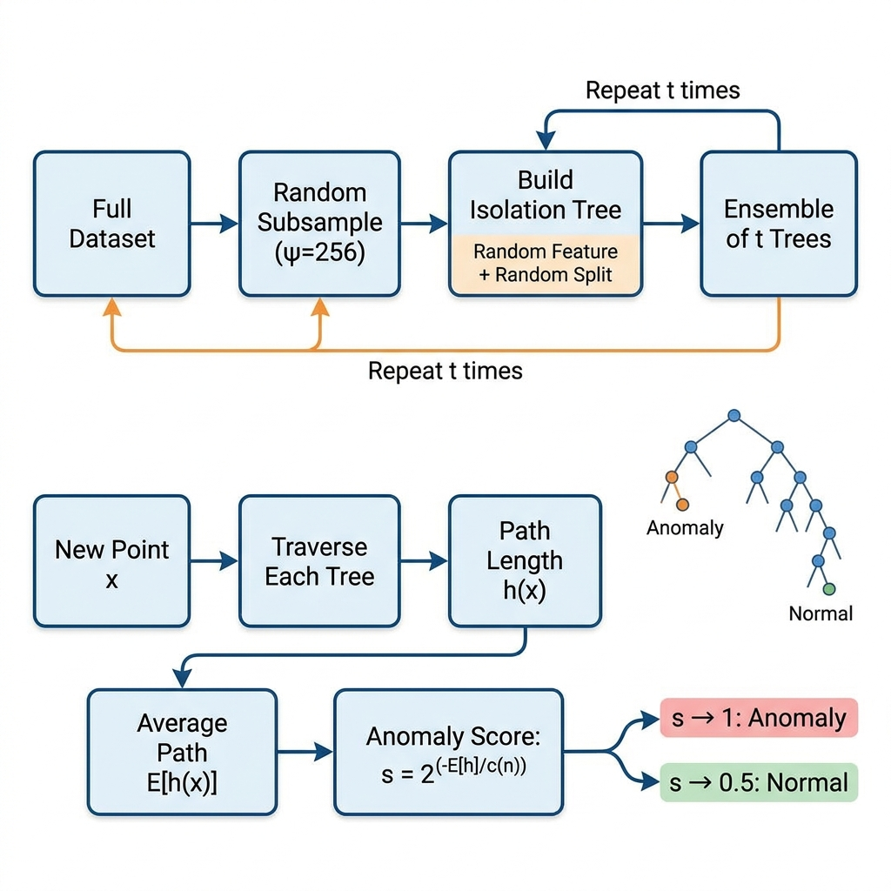

# Isolation Forest for Anomaly Detection

## 1. Introduction

Isolation Forest is a tree-based unsupervised anomaly detection algorithm that works on a beautifully simple principle: **anomalies are few and different, therefore they are easier to isolate**. Instead of building a profile of normal data (like density-based methods), Isolation Forest directly targets anomalies by measuring how quickly a data point can be separated from the rest using random partitions.

**Real-World Analogy:** Imagine sorting a mixed basket of fruits. A single mango among hundreds of apples is isolated in one cut — you pick a feature (colour) and one split separates it. A typical apple requires many careful cuts to distinguish from other apples. Anomalies are the mangoes.

---

## 2. Intuition

The algorithm builds an ensemble of random binary trees (Isolation Trees). Each tree recursively partitions data by selecting a random feature and a random split value. Because anomalies are rare and have extreme values, they tend to be isolated in **fewer splits** — giving them shorter average path lengths. Normal points, clustered together, require more splits. The average path length across all trees becomes the anomaly score.

---

## 3. Mathematical Formulation

**Anomaly Score:**

$$s(x, n) = 2^{-\frac{E[h(x)]}{c(n)}}$$

| Symbol | Meaning |
|--------|---------|
| $h(x)$ | Path length of point $x$ in a single isolation tree |
| $E[h(x)]$ | Average path length across all trees in the forest |
| $c(n)$ | Average path length of unsuccessful search in a BST with $n$ nodes (normalisation factor) |
| $s(x,n)$ | Anomaly score — closer to 1 = anomaly, closer to 0.5 = normal |

**Normalisation constant:**

$$c(n) = 2H(n-1) - \frac{2(n-1)}{n}$$

where $H(k) = \ln(k) + 0.5772$ (Euler-Mascheroni constant, the harmonic number approximation).

**Interpretation:** If $s → 1$, the point is easily isolated (anomaly). If $s → 0.5$, the path length is typical (normal). If $s → 0$, the path is longer than average (very normal / inlier).

---

## 4. How It Works — Step by Step

1. **Subsample** — draw `max_samples` (default 256) points randomly from training data.
2. **Build Isolation Tree** - recursively partition: pick a random feature, pick a random split value between the feature's min and max, separate data into left (< split) and right (≥ split) until each point is isolated or max depth is reached.
3. **Repeat** — build `n_estimators` trees (default 100), each on a fresh subsample.
4. **Score** — for a test point, traverse each tree and record the path length (depth to reach a leaf + adjustment $c(\text{leaf size})$). Average across all trees.
5. **Decide** — use the anomaly score formula; points above a threshold (or the top `contamination` fraction) are flagged.

### Architecture & Flow Diagram



*Worked Example:* Point [100, 200] among mostly [1–10, 1–10] data will be sent to a leaf in 1–2 splits (path length ≈ 2). A normal point [5, 6] requires ~8 splits (path length ≈ 8). The anomaly score for [100, 200] ≈ 0.95 vs. [5, 6] ≈ 0.45.

---

## 5. Key Assumptions

| Assumption | What Happens if Violated |
|-----------|--------------------------|
| Anomalies are **few** (low contamination) | Swamping — anomalies cluster together and appear normal |
| Anomalies have **different attribute values** | Masking — anomalies embedded in normal data are missed |
| Features have meaningful ranges for random splitting | Irrelevant features dilute isolation power |
| `max_samples` is representative | Too small → unstable trees; too large → slow + loses isolation benefit |

---

## 6. When to Use / When Not to Use

| ✅ Use When | ❌ Avoid When |
|------------|-------------|
| Dataset is large (scales linearly with n) | Anomalies form dense clusters (use DBSCAN instead) |
| No labels available (unsupervised) | Data is purely categorical (tree splits are less effective) |
| High-dimensional data (handles it well) | You need interpretable per-feature explanations |
| You need fast training and scoring | Anomaly contamination is very high (> 15%) |

---

## 7. Implementation Overview

| Aspect | From Scratch (NumPy) | Library (sklearn) |
|--------|---------------------|-------------------|
| Tree building | Recursive class with random splits | `IsolationForest` class |
| Path length | Manual traversal + c(n) adjustment | Internal, returns `decision_function()` |
| Scoring | Custom `2^(-E[h]/c(n))` | `score_samples()` (negative anomaly score) |
| Contamination | Manual threshold | `contamination` parameter auto-thresholds |

```python
from sklearn.ensemble import IsolationForest

clf = IsolationForest(n_estimators=100, contamination=0.01, random_state=42)
clf.fit(X_train)
predictions = clf.predict(X_test)  # -1 = anomaly, 1 = normal
```

---

## 8. Top 5 Interview Questions

1. **Why is Isolation Forest efficient for large datasets?**
   - Subsampling (default 256) + shallow trees (log₂ depth) → O(n·t·log ψ) where ψ = max_samples, t = n_estimators.

2. **How does the anomaly score formula work?**
   - It normalises the average path length by c(n). Score near 1 = short paths = easy to isolate = anomaly.

3. **What is the role of `max_samples`?**
   - Controls subsample size. Smaller = faster + reduces swamping/masking; larger = more stable but slower.

4. **Isolation Forest vs. One-Class SVM?**
   - IF: linear time, no kernel, handles high-d well. OC-SVM: quadratic time, kernel-based, better for small datasets with clear boundaries.

5. **Can Isolation Forest detect local anomalies?**
   - Weak at local anomalies — it focuses on global isolation. LOF is better for local density-based anomalies.

---

## 9. Quick Reference Table

| Item | Detail |
|------|--------|
| **Algorithm Type** | Tree-based, ensemble, unsupervised |
| **Training Complexity** | O(t · ψ · log ψ) — t trees, ψ subsample size |
| **Scoring Complexity** | O(t · log ψ) per point |
| **Space Complexity** | O(t · ψ) — stores all trees |
| **Key Hyperparameters** | `n_estimators` (100), `max_samples` (256), `contamination` (auto) |
| **Evaluation Metrics** | AUC-ROC, Precision-Recall AUC, F1-score |
| **Output** | Anomaly score ∈ (0, 1); or binary label (-1/+1) |

---

## 10. References & Further Reading

1. **Original Paper:** Liu, F.T., Ting, K.M., & Zhou, Z.H. (2008). "Isolation Forest." *ICDM*.
2. **Scikit-learn Docs:** [IsolationForest](https://scikit-learn.org/stable/modules/generated/sklearn.ensemble.IsolationForest.html)
3. **Tutorial:** [Isolation Forest — Towards Data Science](https://towardsdatascience.com/outlier-detection-with-isolation-forest-3d190448d45e)
4. **Kaggle Dataset:** [Credit Card Fraud Detection](https://www.kaggle.com/datasets/mlg-ulb/creditcardfraud)
5. **Extended Paper:** Liu, F.T., Ting, K.M., & Zhou, Z.H. (2012). "Isolation-based Anomaly Detection." *ACM TKDD*, 6(1).
