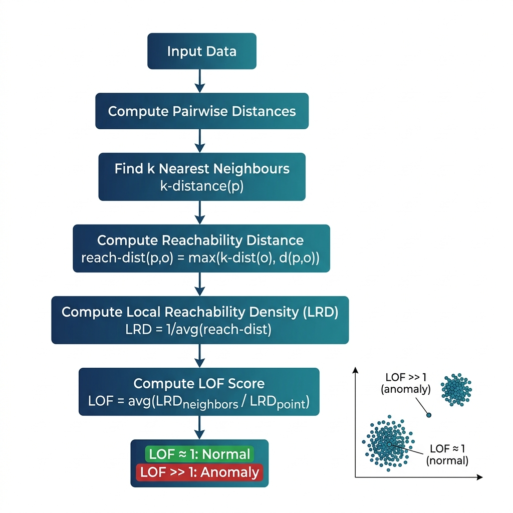

# Local Outlier Factor (LOF) for Anomaly Detection

## 1. Introduction

Local Outlier Factor is a density-based anomaly detection algorithm that identifies outliers by comparing the **local density** of a data point to the local densities of its neighbours. Unlike global methods that use a single threshold, LOF detects **local anomalies** — points that are outliers relative to their immediate neighbourhood even if they appear normal globally.

**Real-World Analogy:** In a city, a house priced at ₹50 lakhs is normal in a middle-class suburb but anomalous in a luxury neighbourhood where every other house costs ₹5 crores. LOF captures this *contextual* notion of abnormality — it compares each point to its local neighbours, not to the entire dataset.

---

## 2. Intuition

LOF works by asking: **"Is this point's neighbourhood as dense as its neighbours' neighbourhoods?"** For a normal point in a dense cluster, the answer is yes — its local density matches. For an outlier sitting between two clusters or on the fringe, its local density is much lower than its neighbours', producing a high LOF score (> 1). A score of approximately 1 means the point is as dense as its neighbours (normal); scores significantly greater than 1 indicate anomalies.

---

## 3. Mathematical Formulation

LOF is built from four nested concepts:

**1. k-distance of point p:**

$$\text{k-dist}(p) = \text{distance to the } k\text{-th nearest neighbour of } p$$

**2. Reachability Distance:**

$$\text{reach-dist}_k(p, o) = \max\!\big(\text{k-dist}(o),\; d(p, o)\big)$$

This smooths short distances — if $p$ is very close to $o$, we still use $o$'s k-distance as a floor.

**3. Local Reachability Density (LRD):**

$$\text{LRD}_k(p) = \frac{1}{\frac{1}{|N_k(p)|} \sum_{o \in N_k(p)} \text{reach-dist}_k(p, o)}$$

The inverse of the average reachability distance to $p$'s $k$ nearest neighbours.

**4. Local Outlier Factor:**

$$\text{LOF}_k(p) = \frac{1}{|N_k(p)|} \sum_{o \in N_k(p)} \frac{\text{LRD}_k(o)}{\text{LRD}_k(p)}$$

| Symbol | Meaning |
|--------|---------|
| $k$ | Number of neighbours considered |
| $N_k(p)$ | Set of k nearest neighbours of point p |
| $d(p,o)$ | Euclidean distance between points p and o |
| LRD | How dense the neighbourhood around a point is |
| LOF | Ratio of neighbour densities to the point's own density |

**Key insight:** LOF ≈ 1 → normal (similar density as neighbours). LOF >> 1 → anomaly (much less dense than neighbours).

---

## 4. How It Works — Step by Step

1. **Compute pairwise distances** between all points (or use a KD-tree for efficiency).
2. **Find k nearest neighbours** for each point and record the k-distance.
3. **Compute reachability distances** — for each point-neighbour pair, take max(k-dist of neighbour, actual distance).
4. **Compute LRD** — inverse of mean reachability distance for each point.
5. **Compute LOF** — for each point, average the ratio of neighbours' LRDs to the point's LRD.
6. **Threshold** — flag points with LOF significantly above 1 (e.g., LOF > 1.5) as anomalies.

### Architecture & Flow Diagram



*Worked Example:* Point A has 5 neighbours all at distance 1 (LRD ≈ 1). Point B (a fringe point) has 5 neighbours at distance 10 (LRD ≈ 0.1). B's neighbours (in the cluster) have LRD ≈ 1. So LOF(B) = mean(1, 1, 1, 1, 1) / 0.1 = 10 → strong anomaly.

---

## 5. Key Assumptions

| Assumption | What Happens if Violated |
|-----------|--------------------------|
| Meaningful distance metric exists | Garbage distances → garbage LOF scores |
| k is chosen appropriately | Too small → noise sensitivity; too large → loss of locality |
| Data has varying local densities (LOF's strength) | Uniform density → LOF ≈ 1 everywhere; use simpler methods |
| Moderate dimensionality | High-d → distances converge → LOF loses discriminative power |

---

## 6. When to Use / When Not to Use

| ✅ Use When | ❌ Avoid When |
|------------|-------------|
| Anomalies are local (differ from their neighbourhood) | Dataset is very large (O(n²) distance computation) |
| Clusters have different densities | Features are high-dimensional (> 20) |
| You need a continuous anomaly score, not just labels | Real-time/streaming detection is needed |
| No prior knowledge of anomaly rate | All clusters have uniform density (simpler methods work) |

---

## 7. Implementation Overview

| Aspect | From Scratch (NumPy) | Library (sklearn) |
|--------|---------------------|-------------------|
| Distance computation | Manual pairwise Euclidean | KD-tree / Ball-tree automatic |
| k-NN search | Sort distance matrix per point | `NearestNeighbors` internally |
| Reachability distance | Explicit max() computation | Internal |
| LOF computation | Manual LRD → LOF loop | `LocalOutlierFactor` class |
| Prediction | `fit()` + `predict()` | `fit_predict()` or `negative_outlier_factor_` |

```python
from sklearn.neighbors import LocalOutlierFactor

lof = LocalOutlierFactor(n_neighbors=20, contamination=0.01)
labels = lof.fit_predict(X)  # -1 = anomaly, 1 = normal
scores = lof.negative_outlier_factor_  # more negative = more anomalous
```

---

## 8. Top 5 Interview Questions

1. **What makes LOF a *local* method?**
   - It compares each point's density to its neighbours' densities, not to a global threshold. This detects anomalies in varying-density data.

2. **Why use reachability distance instead of raw distance?**
   - It smooths out statistical fluctuations for points very close together, making density estimates more stable.

3. **How do you choose k (n_neighbors)?**
   - Rule of thumb: k ∈ [10, 50]. Use the range [k_min, k_max] and take the maximum LOF across the range for robustness.

4. **LOF vs. Isolation Forest?**
   - LOF excels at local anomalies with varying-density clusters. IF excels at global anomalies with large, high-dimensional datasets.

5. **What is the time complexity of LOF?**
   - O(n² · d) naïve distance computation. With KD-tree: O(n · d · log n). Space: O(n²) for distance matrix or O(n · k) with trees.

---

## 9. Quick Reference Table

| Item | Detail |
|------|--------|
| **Algorithm Type** | Density-based, distance-based, unsupervised |
| **Training Complexity** | O(n² · d) naïve; O(n · d · log n) with trees |
| **Scoring Complexity** | O(n · k) after distances computed |
| **Space Complexity** | O(n²) naïve distance matrix; O(n · k) with trees |
| **Key Hyperparameters** | `n_neighbors` (k=20), `contamination`, `metric` |
| **Evaluation Metrics** | AUC-ROC, Precision-Recall AUC, F1-score |
| **Output** | LOF score (≈1 normal, >>1 anomaly); or binary label |

---

## 10. References & Further Reading

1. **Original Paper:** Breunig, M.M., Kriegel, H.P., Ng, R.T., & Sander, J. (2000). "LOF: Identifying Density-Based Local Outliers." *ACM SIGMOD*.
2. **Scikit-learn Docs:** [LocalOutlierFactor](https://scikit-learn.org/stable/modules/generated/sklearn.neighbors.LocalOutlierFactor.html)
3. **Tutorial:** [Understanding LOF — Analytics Vidhya](https://www.analyticsvidhya.com/blog/2021/07/local-outlier-factor-lof-algorithm-for-outlier-identification/)
4. **Kaggle Dataset:** [Credit Card Fraud Detection](https://www.kaggle.com/datasets/mlg-ulb/creditcardfraud)
5. **Textbook:** Aggarwal, C.C. *Outlier Analysis*, Springer, Chapter 4.
