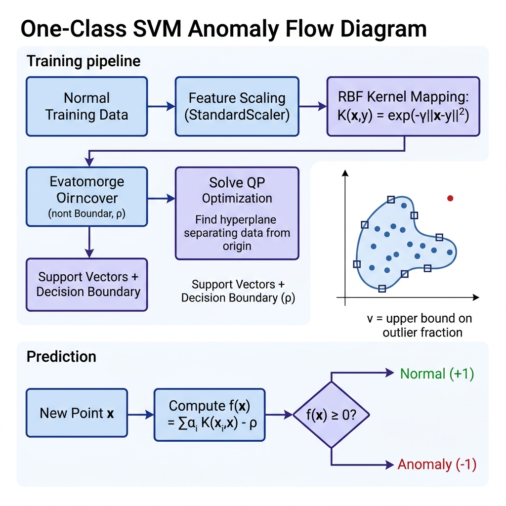

# One-Class SVM for Anomaly Detection

## 1. Introduction

One-Class SVM is a kernel-based unsupervised anomaly detection algorithm that learns a decision boundary enclosing the **"normal"** region of feature space. It is an adaptation of the classical Support Vector Machine for the case where only one class (normal data) is available during training. Points falling outside the learned boundary are classified as anomalies.

**Real-World Analogy:** Imagine drawing the tightest possible boundary around a flock of sheep in a field. Any animal found outside this boundary — a wolf, a stray dog — is flagged as an outlier. One-Class SVM finds this minimum-volume boundary by mapping data into a high-dimensional kernel space and fitting a hyperplane that separates normal data from the origin.

---

## 2. Intuition

Classical SVMs separate two classes with maximum margin. One-Class SVM has only one class — it treats the **origin** in kernel space as the "other class" and finds a hyperplane that maximally separates the training data from the origin. The fraction of training points allowed to fall on the wrong side (outside the boundary) is controlled by the parameter ν (nu), which acts as both an upper bound on the fraction of outliers and a lower bound on the fraction of support vectors.

---

## 3. Mathematical Formulation

**Primal Formulation (Schölkopf et al.):**

$$\min_{w, \xi, \rho} \frac{1}{2}\|w\|^2 + \frac{1}{\nu n}\sum_{i=1}^{n}\xi_i - \rho$$

subject to:

$$w \cdot \Phi(x_i) \geq \rho - \xi_i, \quad \xi_i \geq 0$$

| Symbol | Meaning |
|--------|---------|
| $w$ | Weight vector in kernel feature space |
| $\Phi(x_i)$ | Mapping of point $x_i$ to kernel feature space |
| $\rho$ | Offset / threshold for the decision boundary |
| $\xi_i$ | Slack variable — allows point $i$ to violate the boundary |
| $\nu$ | Upper bound on outlier fraction, lower bound on support vector fraction |
| $n$ | Number of training samples |

**Decision Function:**

$$f(x) = \text{sign}(w \cdot \Phi(x) - \rho)$$

Returns +1 (normal) if the point is inside the boundary, -1 (anomaly) if outside.

**RBF Kernel (most commonly used):**

$$K(x_i, x_j) = \exp\!\left(-\gamma \|x_i - x_j\|^2\right)$$

where $\gamma$ controls the kernel width: small γ → smooth boundary (underfitting); large γ → tight boundary (overfitting).

---

## 4. How It Works — Step by Step

1. **Map data to kernel space** — using the RBF kernel, data is implicitly projected into a high-dimensional (infinite) space.
2. **Find optimal hyperplane** — solve the quadratic programming (QP) problem to find $w$ and $\rho$ that separate data from the origin with maximum margin.
3. **Identify support vectors** — training points on or near the boundary; ν controls their proportion.
4. **Decision boundary** — defined by the support vectors and their dual coefficients.
5. **Classify new points** — compute $f(x) = \text{sign}(\sum_i \alpha_i K(x_i, x) - \rho)$. Positive → normal, negative → anomaly.

### Architecture & Flow Diagram



*Worked Example:* With ν=0.05, the SVM is told "at most 5% of training data can be outliers." It draws a tight boundary around 95%+ of the data. A new point far from any support vector gets $f(x) < 0$ → anomaly.

---

## 5. Key Assumptions

| Assumption | What Happens if Violated |
|-----------|--------------------------|
| Training data is mostly normal (low contamination) | Boundary includes anomalies → missed detections |
| Appropriate kernel and γ selected | Wrong kernel → boundary doesn't capture data shape |
| Features are scaled (zero mean, unit variance) | RBF kernel is distance-based; unscaled features dominate |
| Moderate dataset size | QP solver is O(n²)–O(n³); very slow for large n |

---

## 6. When to Use / When Not to Use

| ✅ Use When | ❌ Avoid When |
|------------|-------------|
| Dataset is small to medium (< 10K samples) | Large datasets (> 50K) — too slow |
| Clear boundary between normal and anomalous regions | Anomalies are embedded within normal clusters |
| Non-linear decision boundaries needed | Data is very high-dimensional (kernel matrix explodes) |
| Training data is clean (mostly normal) | High contamination in training set |

---

## 7. Implementation Overview

| Aspect | From Scratch (NumPy) | Library (sklearn) |
|--------|---------------------|-------------------|
| Kernel matrix | Manual RBF computation | `OneClassSVM` handles internally |
| QP optimisation | Simplified SMO or `scipy.optimize` | Libsvm solver (highly optimised) |
| Support vectors | Manual extraction from dual solution | `support_vectors_` attribute |
| Decision function | Manual $\sum \alpha_i K(x_i, x) - \rho$ | `decision_function()` method |

```python
from sklearn.svm import OneClassSVM

oc_svm = OneClassSVM(kernel='rbf', gamma='scale', nu=0.05)
oc_svm.fit(X_train)
predictions = oc_svm.predict(X_test)  # -1 = anomaly, 1 = normal
scores = oc_svm.decision_function(X_test)  # negative = anomaly
```

---

## 8. Top 5 Interview Questions

1. **What does the ν (nu) parameter control?**
   - It is an upper bound on the fraction of training errors (outliers) AND a lower bound on the fraction of support vectors. ν=0.05 → at most 5% outliers.

2. **Why use RBF kernel for One-Class SVM?**
   - RBF creates non-linear boundaries in input space, capturing complex data shapes. It maps to infinite-dimensional space, giving maximum flexibility.

3. **One-Class SVM vs. Isolation Forest?**
   - OC-SVM: kernel-based, O(n²–n³), better for small datasets with clear boundaries. IF: tree-based, O(n·t·log ψ), scales to large datasets.

4. **How does feature scaling affect One-Class SVM?**
   - Critical — RBF kernel uses Euclidean distances. Without scaling, features with large ranges dominate the kernel computation.

5. **Can One-Class SVM handle multi-modal normal data?**
   - Yes, with appropriate γ — the RBF kernel can model multiple clusters. But very complex distributions may need small γ and more support vectors.

---

## 9. Quick Reference Table

| Item | Detail |
|------|--------|
| **Algorithm Type** | Kernel-based, boundary method, unsupervised |
| **Training Complexity** | O(n² · d) to O(n³) (QP solver) |
| **Scoring Complexity** | O(n_sv · d) per point (n_sv = number of support vectors) |
| **Space Complexity** | O(n²) for kernel matrix during training |
| **Key Hyperparameters** | `nu` (0.05), `kernel` (rbf), `gamma` (scale/auto) |
| **Evaluation Metrics** | AUC-ROC, Precision-Recall AUC, F1-score |
| **Output** | Decision function value (negative = anomaly); or binary label |

---

## 10. References & Further Reading

1. **Original Paper:** Schölkopf, B., Platt, J.C., Shawe-Taylor, J., Smola, A.J., & Williamson, R.C. (2001). "Estimating the Support of a High-Dimensional Distribution." *Neural Computation*, 13(7).
2. **Scikit-learn Docs:** [OneClassSVM](https://scikit-learn.org/stable/modules/generated/sklearn.svm.OneClassSVM.html)
3. **Tutorial:** [One-Class SVM — Towards Data Science](https://towardsdatascience.com/one-class-svm-for-anomaly-detection-6c97f5ea1133)
4. **Kaggle Dataset:** [Credit Card Fraud Detection](https://www.kaggle.com/datasets/mlg-ulb/creditcardfraud)
5. **Textbook:** Schölkopf, B. & Smola, A.J. *Learning with Kernels*, MIT Press, Chapter 8.
