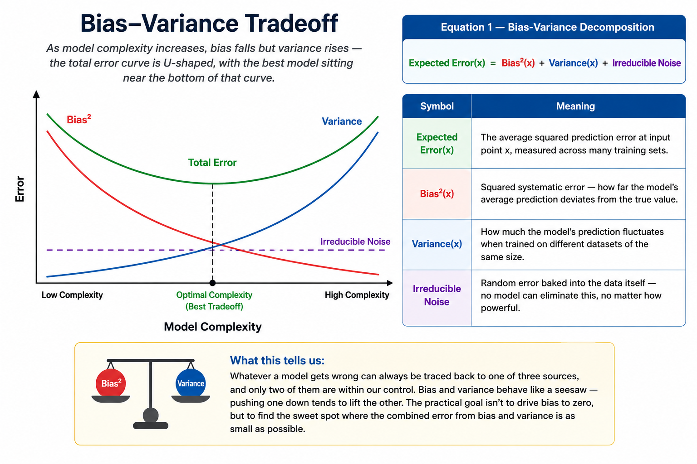

# Bias in Machine Learning

> **"When your model is too confident in the wrong direction — every single time."**

**What you will learn:** You will understand what bias is in Machine Learning, why it causes a model to systematically underfit data, and how it fits into the Bias-Variance Tradeoff that governs every modelling decision. You will also learn how to diagnose high-bias models and apply practical fixes in real-world scenarios.

---

## Table of Contents

1. [What is Bias in Machine Learning?](#1-what-is-bias-in-machine-learning)
2. [Mathematical Formulation](#2-mathematical-formulation)
3. [How Bias Works – Step by Step](#3-how-bias-works--step-by-step)
4. [Key Assumptions](#4-key-assumptions)
5. [When to Use / When Not to Use](#5-when-to-use--when-not-to-use)
6. [Implementation Overview](#6-implementation-overview)
7. [Top 5 Interview Questions](#7-top-5-interview-questions)
8. [Quick Reference Table](#8-quick-reference-table)
9. [References & Further Reading](#9-references--further-reading)

---

## 1. What is Bias in Machine Learning?

**Bias** describes how far off a model's predictions are, on average, when that model is built on assumptions that are too simple for the problem it's trying to solve. Rather than learning the actual pattern hiding in the data, a high-bias model latches onto a fixed, rigid rule and sticks to it no matter what the data is telling it. The outcome isn't random noise — it's a consistent, predictable kind of wrongness that shows up the same way for similar inputs.

Think of a teacher who decides, on the first day of class, that every student who sits in the back row will score poorly — and then grades every back-row assignment with that belief baked in, regardless of the actual quality of the work. The teacher isn't being lazy; they've simply committed to a rule before looking at the evidence, and that rule colours every judgment afterward. A high-bias model does the same thing: it picks its "shape" of the answer before training even starts, and training data can only nudge it slightly — it can't undo a fundamentally wrong shape.

Bias is one side of the **Bias-Variance Tradeoff**, the central balancing act in machine learning. On one side sits high bias (a model too rigid to capture what's really going on, leading to **underfitting**); on the other sits high variance (a model so flexible it starts memorising noise, leading to overfitting). A high-bias model struggles on the training data itself, not just on new data — that's the giveaway. While overfitting is usually caught by noticing a big gap between training and test performance, underfitting hides in plain sight: everything just performs badly, everywhere. Learning to spot and fix bias is one of the first real skills that separates someone who can train a model from someone who can build one that actually works in the real world.

---

## 2. Mathematical Formulation



*Figure 1: As model complexity increases, bias falls but variance rises — the total error curve is U-shaped, with the best model sitting near the bottom of that curve.*

### Equation 1 — Bias-Variance Decomposition

```
Expected Error(x)  =  Bias²(x)  +  Variance(x)  +  Irreducible Noise
```

| Symbol | Meaning |
|---|---|
| `Expected Error(x)` | The average squared prediction error at input point x, measured across many training sets |
| `Bias²(x)` | Squared systematic error — how far the model's average prediction deviates from the true value |
| `Variance(x)` | How much the model's prediction fluctuates when trained on different datasets of the same size |
| `Irreducible Noise` | Random error baked into the data itself — no model can eliminate this, no matter how powerful |

**What this tells us:** Whatever a model gets wrong can always be traced back to one of three sources, and only two of them are within our control. Bias and variance behave like a seesaw — pushing one down tends to lift the other. The practical goal isn't to drive bias to zero, but to find the sweet spot where the *combined* error from bias and variance is as small as possible.

### Equation 2 — Definition of Bias

```
Bias(x)  =  E[ f̂(x) ]  −  f_true(x)
```

| Symbol | Meaning |
|---|---|
| `Bias(x)` | The bias of the model at input x |
| `E[ f̂(x) ]` | Expected (average) prediction of the model at x, averaged over many possible training datasets |
| `f̂(x)` | The model's actual prediction for input x |
| `f_true(x)` | The true underlying value at x — the correct answer the model is trying to approximate |

**What this tells us:** Bias isn't about one prediction being wrong on one occasion — it's about what happens *on average*. Picture training the same kind of model on a hundred different samples of data and then averaging all the predictions it makes at a particular point. If that average prediction is consistently off from the real answer, that gap is the bias. It tells you the model has a built-in lean in one direction.

**Why balancing bias and variance matters:** When a model is too simple for the job, it has high bias and misses patterns that are actually there. When it's too complex, it has high variance and starts treating random noise as if it were a real pattern. Neither extreme generalises well to new data. The sweet spot is the level of complexity where the sum of Bias² and Variance (plus the unavoidable noise term) is at its lowest.

---

## 3. How Bias Works – Step by Step


*Figure 2: A straight line forced onto data that actually curves — the line misses the pattern everywhere, which is exactly what underfitting looks like.*

**1. Data is collected**

Someone gathers real-world observations. Buried inside that data is a genuine pattern worth learning, plus some amount of noise — random variation no model can ever fully explain away.

*Example: A bank collects 10,000 loan applications — income, credit score, loan amount, repayment history — along with whether each applicant defaulted.*

---

**2. Model assumptions are chosen**

Before training begins, someone has to pick what kind of model to use, and that choice quietly bakes in assumptions about the shape of the relationship — straight line, curve, branching tree, and so on. Pick a model that's too simple, and those baked-in assumptions become a ceiling the model can never rise above.

*Example: The developer chooses a simple linear model, assuming default risk increases in a straight line with debt amount. In reality the relationship is non-linear and depends on multiple interacting features.*

---

**3. The model learns from training data**

Training is the model doing its best within the box it's been placed in — adjusting its internal numbers to fit the data as closely as its assumed shape allows. If that shape is wrong for the problem, no amount of training will fix it.

*Example: The linear model finds the best-fit line between debt amount and default risk. It does its best within the constraint of being a straight line — but a straight line cannot represent a curved, multi-factor relationship.*

---

**4. Oversimplification occurs**

The model's rigid assumption prevents it from capturing the true pattern. The gap between the learned function and the true function is the bias.

*Example: Young applicants with high debt and excellent credit history are incorrectly predicted as high-risk because the model only looks at debt and draws a straight line.*

---

**5. Underfitting happens**

The model performs poorly on training data — not just test data. This is the diagnostic signature of high bias: both train and test errors are high and close together.

*Example: Training accuracy is 68%. Test accuracy is 66%. The model is not overfitting — it simply has not learned the data's true structure.*

---

**6. Prediction error is systematically large**

Errors are not random — they are directional. The model is wrong in the same way for the same types of inputs, making it unreliable for production decisions.

*Example: The model consistently approves risky applicants who have high income but poor repayment history, because its oversimplified assumption missed the repayment pattern entirely.*

---

## 4. Key Assumptions

| Assumption | Why it exists | What happens if violated |
|---|---|---|
| **Model assumptions match the true data-generating process** | Every algorithm has a built-in prior about the shape of the relationship | If the true relationship is curved but a linear model is used, bias is structurally permanent — more data cannot fix a wrong assumption |
| **Features contain useful signal for predicting y** | Bias is measured against the true function — requires X to relate to y | Irrelevant features mean the model cannot learn any meaningful mapping; all predictions converge to the mean |
| **Training data represents the true population** | The model generalises from training examples to the real world | If training data is unrepresentative, bias is introduced not by the model but by the data — models trained on young patients fail on elderly ones |
| **Labels are reasonably accurate** | The model learns to predict y; systematic label errors corrupt the target | Systematic mislabelling shifts the learned function away from the true function — a form of data-level bias |
| **Model has sufficient capacity for the problem** | The model must have enough parameters to express the true relationship | Too few parameters guarantee underfitting regardless of data volume — you cannot represent a circle with a straight line |

---

## 5. When to Use / When Not to Use

| ✅ When to Accept Higher Bias | ❌ When Not to Accept High Bias |
|---|---|
| **Small datasets**: simpler models generalise better — complex models overfit when data is limited | **Large, rich datasets**: enough data exists to support complex models; high bias wastes available signal |
| **Interpretability required**: linear models are auditable and legally defensible (credit scoring, medical risk) | **Complex non-linear problems**: vision, NLP, genomics — simple models structurally cannot capture the pattern |
| **Regularisation is applied**: L1/L2 adds controlled bias to prevent overfitting in high-dimensional data | **High accuracy is critical**: fraud detection, medical diagnosis — systematic directional errors are costly |
| **Baseline benchmarking**: always start with a high-bias model as a sanity check before adding complexity | **Data has clear non-linear structure**: decision boundaries that are not straight lines need flexible models |
| **Latency constraints in production**: linear models score in microseconds; complex models add latency | **Underfitting is already observed**: train and test error both high — adding more bias makes it worse |

---

## 6. Implementation Overview

### From Scratch (NumPy)

Building a model from scratch means writing out the maths yourself — defining the prediction formula, computing the loss, and coding the update rule that adjusts parameters step by step. Doing this is:

- **Educational**: every line of code maps to a mathematical step, so bias becomes visible as the gap between what the model predicts and the true values that never closes, even after training finishes
- **Fully controllable**: every assumption is explicit and yours to change, making it easy to see how different functional forms (a line vs. a curve) lead to different amounts of bias
- **Impractical for production**: lacks the optimisation tricks, edge-case handling, and testing that production-grade libraries provide

For a linear model from scratch, you would write `ŷ = Xθ`, compute `MSE = (1/n) Σ(y - ŷ)²`, then update `θ = θ - α · ∂MSE/∂θ` at each step — watching bias manifest as a persistent non-zero loss even after convergence.

### Using Scikit-learn

Scikit-learn wraps all of that maths into a simple three-step pattern: `fit()`, `predict()`, `score()`. You don't write the optimisation loop yourself, but you still control bias through hyperparameters:

- **Regularisation strength** (`C` in Logistic Regression, `alpha` in Ridge): a small `C` or a large `alpha` forces the model to stay simple, which raises bias but lowers variance
- **Model family**: `LinearRegression`, `PolynomialFeatures` + `LinearRegression`, and `RandomForestRegressor` sit at different points on the bias-variance spectrum — from rigid to flexible
- **Tree depth** (`max_depth`): a shallow tree has high bias (too simple); a very deep tree has high variance (too specific)

```python
# Bias demonstration using Scikit-learn — Iris Dataset
# Kaggle: https://www.kaggle.com/datasets/uciml/iris

from sklearn.datasets import load_iris
from sklearn.model_selection import train_test_split
from sklearn.linear_model import LogisticRegression
from sklearn.metrics import accuracy_score

# Load dataset
iris = load_iris(as_frame=True)
X, y = iris.data, iris.target

# Split: 80% train, 20% test — random_state ensures reproducibility
X_train, X_test, y_train, y_test = train_test_split(
    X, y, test_size=0.2, random_state=42
)

# High-bias model: C=0.01 applies strong regularisation
# Low C → high bias → model underfits → lower accuracy
high_bias = LogisticRegression(C=0.01, max_iter=200, random_state=42)
high_bias.fit(X_train, y_train)

# Low-bias model: C=100 applies minimal regularisation
# High C → low bias → model fits data more closely
low_bias = LogisticRegression(C=100, max_iter=200, random_state=42)
low_bias.fit(X_train, y_train)

print(f"High-Bias (C=0.01) Test Accuracy : {accuracy_score(y_test, high_bias.predict(X_test)):.4f}")
print(f"Low-Bias  (C=100)  Test Accuracy : {accuracy_score(y_test, low_bias.predict(X_test)):.4f}")
```

---

## 7. Top 5 Interview Questions

---

**Q1. What is bias in Machine Learning?**

- Error that comes from a model's assumptions being too simple for the problem
- Predictions are off in a consistent, predictable direction — not randomly scattered
- Formally: `Bias(x) = E[f̂(x)] − f_true(x)`
- It's a modelling problem, not a data-noise problem — the model's "shape" is wrong, not the data
- Good way to phrase it in an interview: "bias means the model's assumptions don't match the real pattern, so it's wrong in the same way every time"

---

**Q2. What is the difference between high bias and high variance?**

- High bias: model too simple → underfits → high error on both train and test
- High variance: model too complex → overfits → low train error, high test error
- High bias: errors are consistent and directional
- High variance: errors are large and unpredictable across different datasets
- Diagnosis: if train error ≈ test error and both are high → high bias

---

**Q3. Why does high bias cause underfitting?**

- Underfitting means the model can't represent the real relationship between inputs and outputs
- A high-bias model makes the same kind of mistake regardless of which input you give it
- Throwing more data at it won't help — the bottleneck is the model's shape, not the amount of data
- Analogy: trying to trace a wavy line using only a ruler — no matter how many times you trace it, a straight edge can never become a curve
- The fix is to change the model family or loosen regularisation, not to collect more rows of data

---

**Q4. How can bias be reduced?**

- Use a more complex model (deeper tree, polynomial features, neural network)
- Add more informative features through feature engineering
- Reduce regularisation strength (increase `C` in Logistic Regression, decrease `alpha` in Ridge)
- Remove overly restrictive constraints on the model's functional form
- Warning: every reduction in bias increases variance — monitor test performance with cross-validation

---

**Q5. Explain the Bias-Variance Tradeoff.**

- Total error = Bias² + Variance + Irreducible Noise
- Reducing bias (more complex model) → increases variance
- Reducing variance (regularisation, simpler model) → increases bias
- Goal: find model complexity where total error is minimised
- Tools: learning curves, cross-validation, regularisation path plots
- Rule of thumb: start simple (accept some bias), increase complexity until test error stops improving

---

## 8. Quick Reference Table

| Item | Detail |
|---|---|
| **Definition** | Systematic prediction error caused by a model's assumptions being too simple to capture the real pattern in the data |
| **Algorithm Type** | A concept that applies across all of supervised learning — regression, classification, and ensemble methods alike |
| **Input** | Feature matrix X (numeric and/or categorical variables describing each sample) |
| **Output** | Predicted target values ŷ (a class label for classification, a continuous value for regression) |
| **Time Complexity** | O(n·p) for linear models (n = number of samples, p = number of features); high-bias models are typically the cheapest to train |
| **Space Complexity** | O(p) to store learned parameters in linear models; O(1) extra memory needed at prediction time |
| **Key Hyperparameters** | Regularisation strength (C, alpha, lambda), tree depth (max_depth), polynomial degree, number of features used |
| **Evaluation Metrics** | Gap between train and test accuracy, MSE/RMSE on the training set, learning curves, cross-validation scores |
| **Applications** | Baseline models for credit scoring, quick prototypes before scaling up, interpretable models required for regulated industries (finance, healthcare) |
| **Advantages** | Fast to train, easy to interpret, less likely to overfit, stable across different training samples |
| **Limitations** | Cannot capture complex or non-linear relationships; more training data does not fix the underlying problem |
| **Python Libraries** | scikit-learn (`LinearRegression`, `LogisticRegression`, `Ridge`), NumPy, pandas, matplotlib |

---

## 9. References & Further Reading

1. **Bishop, C. M. (2006). *Pattern Recognition and Machine Learning*.** Springer. — Chapter 3 covers the Bias-Variance decomposition with full probabilistic treatment. Free PDF via Microsoft Research.

2. **Géron, A. (2022). *Hands-On Machine Learning with Scikit-Learn, Keras & TensorFlow* (3rd ed.).** O'Reilly. — Chapter 4 explains underfitting, overfitting, and regularisation with practical Scikit-learn code.

3. **Mitchell, T. M. (1997). *Machine Learning*.** McGraw-Hill. — Foundational text covering the formal definition of learning error and the bias-variance decomposition.

4. **Scikit-learn Documentation — Regularisation:** [https://scikit-learn.org/stable/modules/linear_model.html](https://scikit-learn.org/stable/modules/linear_model.html) — Official guide to controlling bias through regularisation in linear models.

5. **Kaggle — Iris Dataset:** [https://www.kaggle.com/datasets/uciml/iris](https://www.kaggle.com/datasets/uciml/iris) — Real dataset used in the code example. Run the code locally and compare train vs test accuracy to observe bias effects directly.

---

*Gradientts • Advanced AI Engineering Program • 2026 • Educational Content • Beginner Friendly*