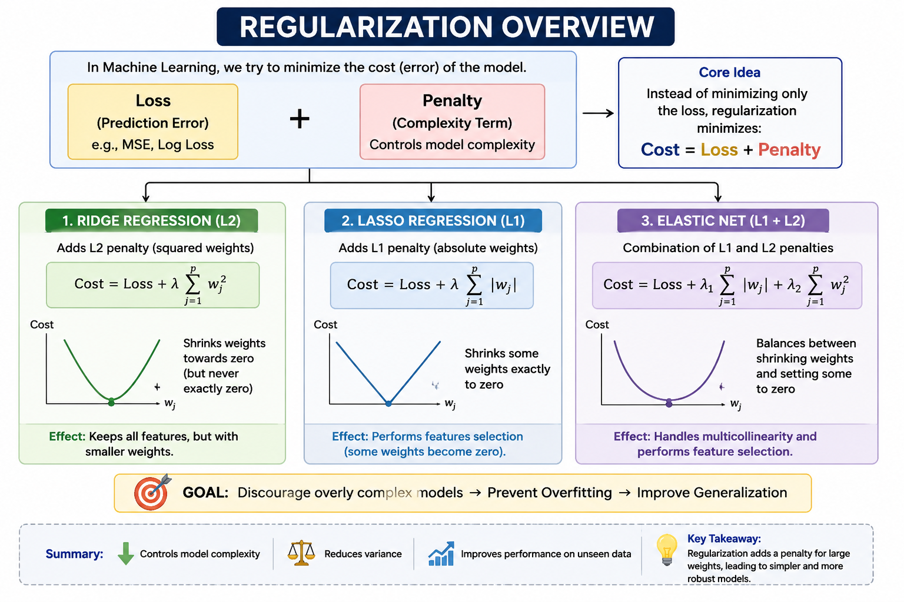
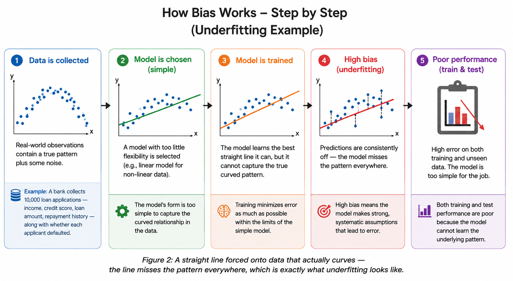

# Regularization in Machine Learning

> **"Teaching a model to stay humble even when the data is tempting it to show off."**

**What you will learn:** This guide explains what regularization is, why it's one of the first tools every ML practitioner reaches for to stop overfitting, and how Ridge, Lasso, Elastic Net, and Dropout each constrain a model's complexity in their own distinct way. By the end, you'll be comfortable applying these techniques with scikit-learn and explaining the trade-offs in an interview.

---

## Table of Contents

1. [What is Regularization?](#1-what-is-regularization)
2. [Mathematical Formulation](#2-mathematical-formulation)
3. [How Regularization Works – Step by Step](#3-how-regularization-works--step-by-step)
4. [Key Assumptions](#4-key-assumptions)
5. [When to Use / When Not to Use](#5-when-to-use--when-not-to-use)
6. [Implementation Overview](#6-implementation-overview)
7. [Top 5 Interview Questions](#7-top-5-interview-questions)
8. [Quick Reference Table](#8-quick-reference-table)
9. [References & Further Reading](#9-references--further-reading)

---

## 1. What is Regularization?

Picture a student preparing for an exam by memorizing the exact wording of every practice question they've come across, rather than understanding the concepts behind them. That student will ace those exact questions — but the moment the real exam rephrases something even slightly, they're stuck. **Regularization** is what stops a machine learning model from falling into the same trap. It discourages the model from becoming so finely tuned to its training data that it loses the ability to handle anything new.

In practical terms, regularization works by adding a small "penalty" to the model's loss function — the score that measures how wrong its predictions are. This penalty grows whenever the model's weights (the numbers it uses to combine input features into a prediction) get too large. Unusually large weights are often a sign that the model is leaning hard on very specific quirks of the training set — quirks that are unlikely to repeat in new data. By taxing large weights, regularization pushes the model toward simpler, smoother solutions that generalize better to data it hasn't seen yet.

Here's an analogy that tends to stick: imagine a chef who's told, "use as many spices as you like, but every extra spice costs you points." A chef with no such rule might throw in twenty spices to make a dish taste perfect to one specific judge — but that same dish would taste overwhelming to anyone else. A chef working under the "spice tax" sticks to a handful of spices that genuinely improve the dish, and the result tastes good to a much wider audience. Regularization is that spice tax for machine learning — it forces a model to justify every bit of complexity it carries, keeping only what actually helps. This becomes especially important when a model has many features relative to the amount of training data — situations where, without some restraint, a model can effectively memorize the training set instead of learning from it.

### Why Regularization is Required

Without some form of regularization, a model trained for long enough on a fixed dataset will keep chasing smaller and smaller improvements in training error — even if that means contorting itself around a handful of outliers or coincidental patterns that exist only in that particular sample. This is exactly the behaviour we don't want, because the dataset is never the full picture; it's just one sample drawn from a much larger space of possible data. Regularization exists to keep the model honest about that distinction — it caps how much the model can lean on any single feature, so the patterns it learns are more likely to be patterns that hold up in general, not just in the data it happened to see.

There's also a quieter, practical reason: real-world datasets almost never contain perfectly independent, equally informative features. Some features are redundant, some are correlated, and some are just noisy measurements. Without a penalty on weight size, a model is free to assign huge, unstable weights to combinations of correlated features — weights that could flip sign or magnitude dramatically with a tiny change in the training data. Regularization keeps these weights bounded and stable, which is part of why regularized models tend to behave more predictably when retrained on slightly different data.

---

## 2. Mathematical Formulation



*Figure 1: Ridge, Lasso, and Elastic Net each add a different penalty term to the loss function, shrinking model weights in different patterns.*

At its core, regularization simply changes what the model is trying to minimize. Instead of minimizing only the prediction error (the "Loss" term, such as mean squared error for regression or log-loss for classification), the model now minimizes **Loss + Penalty**. The penalty term is what makes the difference between the three approaches below.

### Ridge Regression (L2 Regularization)

```
Cost = Loss + λ Σ w²
```

| Symbol | Meaning |
|---|---|
| `Cost` | The new quantity the model tries to minimize during training |
| `Loss` | The original error measure — how far predictions are from actual values (e.g., MSE, log-loss) |
| `λ` (lambda) | The regularization strength — a number you choose that controls how harshly large weights are punished |
| `Σ w²` | The sum of the squares of all the model's weights |

**What this means:** Ridge adds a penalty proportional to the *square* of every weight, then adds all those squared values up. Because squaring makes large numbers grow even larger, Ridge is especially harsh on weights that are very big — it pushes all weights toward smaller values, but rarely pushes any weight all the way to exactly zero. The result is a model where every feature still contributes a little, but no single feature is allowed to dominate. Increasing `λ` increases the pressure to keep weights small; setting `λ = 0` brings you back to a plain, unregularized model.

### Lasso Regression (L1 Regularization)

```
Cost = Loss + λ Σ |w|
```

| Symbol | Meaning |
|---|---|
| `Cost` | The new quantity the model tries to minimize during training |
| `Loss` | The original error measure, exactly as in Ridge |
| `λ` (lambda) | The regularization strength — controls how strongly weights are pushed toward zero |
| `Σ \|w\|` | The sum of the *absolute values* of all the model's weights |

**What this means:** Lasso penalizes the absolute size of each weight rather than its square. This might sound like a small difference, but it has a big practical consequence: Lasso has a tendency to push some weights all the way to **exactly zero**, effectively removing those features from the model entirely. This makes Lasso useful not just for controlling overfitting, but also for automatic feature selection — it can tell you which features the model considers unnecessary by zeroing them out completely.

### Elastic Net

```
Cost = Loss + λ₁ Σ |w| + λ₂ Σ w²
```

| Symbol | Meaning |
|---|---|
| `Cost` | The new quantity the model tries to minimize during training |
| `Loss` | The original error measure, exactly as above |
| `λ₁` (lambda one) | Controls the strength of the L1 (Lasso-style) penalty |
| `λ₂` (lambda two) | Controls the strength of the L2 (Ridge-style) penalty |
| `Σ \|w\|` | The sum of absolute weight values (the Lasso term) |
| `Σ w²` | The sum of squared weight values (the Ridge term) |

**What this means:** Elastic Net is a blend — it adds both penalty types together, each with its own strength setting. This gives you the best of both worlds: the feature-selection behavior of Lasso (some weights can become exactly zero) combined with the smoother, more stable shrinkage of Ridge (which handles groups of correlated features better than Lasso alone). Tuning `λ₁` and `λ₂` lets you slide along a spectrum between pure Ridge (`λ₁ = 0`) and pure Lasso (`λ₂ = 0`).

### Dropout (for Neural Networks)

```
ŷ = f( (X ⊙ M) · W ),   where each element of M ~ Bernoulli(p)
```

| Symbol | Meaning |
|---|---|
| `ŷ` | The network's output (prediction) for a given input |
| `f` | The activation/transformation applied by the layer |
| `X` | The input vector arriving at a layer (e.g., the activations from the previous layer) |
| `M` | A random "mask" vector of the same shape as `X`, where each entry is either 0 or 1 |
| `⊙` | Element-wise multiplication — each entry of `X` is multiplied by the matching entry of `M` |
| `Bernoulli(p)` | A coin-flip distribution: each entry of `M` is 1 with probability `p` (keep) and 0 with probability `1 − p` (drop) |
| `W` | The layer's weight matrix |

**What this means:** Dropout takes a completely different approach from Ridge, Lasso, and Elastic Net — instead of shrinking weight values directly, it randomly "switches off" a fraction of neurons during each training step, forcing the rest of the network to not become overly reliant on any single neuron. Think of it as randomly benching a portion of your team during every practice session — the remaining players have to learn to cover for each other, so no single player becomes a single point of failure. At test time, dropout is turned off (`M` becomes all 1s, or activations are rescaled accordingly), and the network uses all its neurons together, now more robust because no individual neuron was ever indispensable.

### Effect on Model Complexity

All four techniques above are, at their heart, ways of *removing degrees of freedom* from a model without changing its architecture. Ridge and Elastic Net keep every weight "alive" but compress how much any one of them can move, effectively shrinking the space of functions the model can represent toward smoother, flatter ones. Lasso goes a step further by allowing weights to vanish entirely, which is like deleting connections from the model outright — the model that remains is structurally simpler, with fewer active inputs. Dropout achieves something similar for neural networks by preventing the network from building large, complicated co-dependencies between specific neurons — each sub-network that survives a dropout pass has to be "simple enough" to work on its own. In every case, the practical effect is the same: the model is nudged away from the most complex function it *could* represent and toward a simpler one that's *more likely to be correct*.

### Effect on Bias and Variance

Regularization is, in essence, a dial that trades variance for bias. An unregularized model with many parameters has low bias (it can fit almost anything) but high variance (small changes in training data produce very different fitted models). Turning up the regularization strength pulls weights toward zero, which increases bias slightly — the model becomes less flexible and may miss some genuine patterns — but reduces variance substantially, because the model is no longer free to swing wildly based on a handful of unusual training points. The goal is never to eliminate bias or variance entirely; it's to find the setting where their *combined* contribution to error is smallest. This is why regularization strength is almost always tuned via cross-validation rather than guessed — the right amount depends entirely on how much variance the unregularized model has to begin with.

No derivations are needed to use these formulas in practice — what matters is the intuition: every one of these equations is just "error + a cost for complexity," and turning the knob (`λ`, `λ₁`, `λ₂`) up or down controls how much the model is willing to pay for that complexity.

---

## 3. How Regularization Works – Step by Step



*Figure 2: Regularization slots into the normal training loop as an extra term added to the loss before the optimizer takes its step.*

**1. Data is collected**

Before any modeling happens, you need a dataset — examples of inputs paired with the correct outputs you want the model to learn to predict.

*Example: An e-commerce company collects data on 50,000 past customers, recording 200 different behavioral features (pages visited, time spent, past purchases, etc.) along with whether each customer made a purchase.*

---

**2. Model is initialized**

The model starts with a set of weights — one for each feature — usually set to small random values or zeros. At this point, the model has no idea which features matter.

*Example: The model assigns a starting weight close to zero to each of the 200 behavioral features, with no sense yet of which ones actually predict a purchase.*

---

**3. Loss is computed**

The model makes predictions using its current weights, and those predictions are compared against the true outcomes to calculate the loss — a single number representing how wrong the model currently is.

*Example: Using its initial (mostly useless) weights, the model predicts purchase probabilities for all 50,000 customers, and the loss function measures how far off those predictions are from what customers actually did.*

---

**4. Penalty is added**

Before the optimizer does anything with the loss, the regularization penalty is added on top of it — based on the current size of all the weights, using whichever formula (Ridge, Lasso, or Elastic Net) was chosen.

*Example: Two of the 200 weights have grown unusually large because they happen to fit a handful of unusual customers perfectly. The penalty term adds an extra cost specifically because those two weights are large, even though they're helping reduce the raw loss.*

---

**5. Optimizer minimizes the penalized loss**

The optimizer (such as gradient descent) now adjusts the weights to reduce **Cost = Loss + Penalty**, not just the raw loss. This means the optimizer has to balance "fit the data well" against "don't let any weight get too big."

*Example: The optimizer finds that reducing those two unusually large weights slightly increases the raw loss a little, but reduces the penalty by much more — so overall, shrinking them lowers the total cost, and the optimizer does exactly that.*

---

**6. Weights shrink**

Over many training iterations, weights that aren't pulling their weight (so to speak) — features that only helped fit noise — get pushed toward smaller values, or in Lasso's case, all the way to zero.

*Example: By the end of training, 40 of the 200 behavioral features end up with weights at or very near zero (thanks to the Lasso penalty), meaning the model has effectively decided those features don't meaningfully predict purchases.*

---

**7. Better generalization**

With smaller, more conservative weights, the model's predictions become less sensitive to the specific quirks of the training set — and more reflective of patterns that hold true generally. When tested on new customers it has never seen, its performance holds up much better than an unregularized model's would.

*Example: On a held-out set of 10,000 new customers, the regularized model's accuracy is nearly identical to its training accuracy — while an unregularized version of the same model, which had memorized quirks of the original 50,000 customers, performs noticeably worse on the new group.*

---

### Relationship with Overfitting

Overfitting happens when a model becomes so flexible that it starts treating the random noise in the training data as if it were a real, meaningful pattern. You can usually spot it by comparing training accuracy with validation accuracy — if training accuracy is excellent but validation accuracy is noticeably worse, the model has likely learned things that don't actually generalize. Regularization addresses this head-on: by penalizing large weights, it limits how tightly the model can wrap itself around the specific training examples it was shown, leaving it less able to "memorize" and more inclined to capture broad trends instead.

### Relationship with Underfitting

Underfitting is the opposite problem — the model is too constrained to capture even the genuine patterns in the data, so it performs poorly on the training set itself, not just on new data. This is where regularization needs to be applied carefully: cranking the penalty too high pushes a perfectly capable model into underfitting territory, because the penalty starts dominating the loss and the model is discouraged from using its weights at all, even the ones that matter. If you notice both training and validation performance are poor, that's usually a sign to *reduce* regularization strength rather than increase it.

---

## 4. Key Assumptions

| Assumption | Why it exists | What happens if violated |
|---|---|---|
| **Features should be on a similar scale** | The penalty term sums weights together — if one feature's values are in the thousands and another's are between 0 and 1, the model will need a much larger weight for the second feature just to use it, and that weight gets unfairly penalized more | Without scaling (e.g., StandardScaler), regularization penalizes features with naturally smaller ranges far more harshly than features with large ranges, distorting which features the model "keeps" |
| **The regularization strength (λ) is properly tuned** | Too little penalty barely changes anything; too much penalty crushes every weight toward zero, including useful ones | An untuned λ either leaves overfitting unaddressed (too small) or causes severe underfitting where the model can barely use any features (too large) |
| **The chosen penalty type matches the problem's structure** | Lasso assumes that many features are likely irrelevant and can be dropped; Ridge assumes most features contribute a little; Elastic Net assumes groups of correlated features matter together | Using Lasso when all features genuinely matter can discard useful information; using Ridge when most features are noise leaves that noise diluted but not removed |
| **The underlying relationship between features and target is at least roughly linear (for linear-model regularization)** | Ridge, Lasso, and Elastic Net as written here are penalty terms added to linear models' loss functions | Applying these exact formulas to a fundamentally non-linear problem won't help much — the penalty controls weight size, but can't fix a model that's the wrong shape for the data |
| **Enough data exists to estimate weights meaningfully** | Regularization helps when there's *some* signal to extract but a risk of overfitting to noise; it can't manufacture signal from nothing | With extremely little data, even a heavily regularized model may not learn anything useful — regularization controls overfitting, but doesn't replace the need for sufficient data |

### Common Misconceptions

A few mix-ups come up often enough that they're worth calling out directly:

- **"More regularization is always better."** Not true — past a certain point, regularization starts removing signal along with noise, pushing a healthy model into underfitting. It's a dial to be tuned, not a setting to maximize.
- **"Regularization and feature scaling are unrelated steps."** They're tightly linked — because the penalty term sums weight values across all features, unscaled features (some large, some small) get penalized unevenly, which can quietly distort which features the model keeps.
- **"L1 and L2 are basically the same thing, just with different exponents."** The exponent difference looks small on paper, but it leads to genuinely different behaviour: L2 shrinks everything a little, while L1 can zero things out entirely. They solve overlapping but distinct problems.
- **"Dropout is just 'L2 regularization for neural networks.'"** Dropout and weight-decay-style penalties (Ridge/Lasso-like terms) are often used *together* in neural networks — they're complementary techniques operating through different mechanisms, not interchangeable substitutes for each other.
- **"Regularization will fix a model that's underfitting."** As covered earlier, regularization adds constraints — it can only make an already-too-simple model simpler still. If the model isn't fitting the training data well, the fix lies elsewhere (more capacity, better features, less regularization).

---

## 5. When to Use / When Not to Use

| ✅ When Regularization Helps | ❌ When Regularization May Not Help (or Could Hurt) |
|---|---|
| **Many features relative to samples**: when you have more (or nearly as many) features as data points, regularization prevents the model from "memorizing" individual rows | **Very few features, lots of data**: with a handful of well-understood features and abundant data, overfitting risk is low, so regularization may add unnecessary bias |
| **Correlated features**: Ridge and Elastic Net handle groups of features that move together more gracefully than an unregularized model would | **Every feature is known to be essential**: if domain knowledge confirms all features genuinely matter, Lasso's tendency to zero out weights could discard useful information |
| **Need for feature selection**: Lasso or Elastic Net can automatically identify and discard irrelevant features, simplifying the model | **Model is already underfitting**: if a model is already too simple and performing poorly on training data, adding more penalty makes the problem worse, not better |
| **Noisy data**: when training data contains a lot of random noise, regularization helps the model focus on the signal rather than fitting the noise | **Interpretability of raw coefficients matters**: regularized coefficients are shrunk versions of the "true" relationships, which can complicate certain statistical interpretations |
| **Building a production model that must generalize**: any time the model will face new, unseen data, some amount of regularization is almost always worth testing | **Extremely high λ without tuning**: cranking regularization strength up arbitrarily high can shrink all weights toward zero, producing a model that barely uses any of its features |

---

## 6. Implementation Overview

### From Scratch (NumPy)

Implementing regularization from scratch means modifying the loss function calculation and the gradient update step that the optimizer uses. Conceptually, here's what changes:

- **Loss calculation**: after computing the normal loss (say, mean squared error), you add the penalty term — `λ * sum(w**2)` for Ridge, or `λ * sum(abs(w))` for Lasso — to get the total cost.
- **Gradient calculation**: when the optimizer figures out how to adjust each weight, it now also accounts for the derivative of the penalty term. For Ridge, this adds a term proportional to `2 * λ * w` to each weight's gradient — meaning bigger weights get pushed down harder. For Lasso, the penalty's derivative is a constant (`λ` or `-λ`, depending on the weight's sign), which is why Lasso can push weights all the way to exactly zero rather than just shrinking them.
- **Why this matters educationally**: writing this out by hand makes it very clear that regularization isn't a separate "step" tacked onto training — it's woven directly into the loss the model is optimizing, at every single training iteration.

### Using Scikit-learn

Scikit-learn makes regularization almost invisible — it's built directly into the model classes you already use, controlled by a hyperparameter:

- **`Ridge`**, **`Lasso`**, and **`ElasticNet`** are dedicated regression classes where the `alpha` parameter controls `λ` (higher `alpha` = more regularization).
- **`LogisticRegression`** uses a parameter called `C`, which works in the *opposite* direction — `C` is the inverse of regularization strength. A **small `C`** means **strong regularization** (weights are pushed hard toward zero), while a **large `C`** means **weak regularization** (weights are allowed to grow more freely to fit the data closely).
- The `penalty` parameter (`'l1'`, `'l2'`, or `'elasticnet'`) selects which type of penalty `LogisticRegression` applies.

The example below uses the classic Iris dataset (also available on Kaggle: https://www.kaggle.com/datasets/uciml/iris) to compare a strongly regularized model against a weakly regularized one, showing how the choice of `C` affects how closely the model fits the training data.

```python
# Regularization demonstration using Scikit-learn — Iris Dataset
# Kaggle: https://www.kaggle.com/datasets/uciml/iris

from sklearn.datasets import load_iris
from sklearn.model_selection import train_test_split
from sklearn.linear_model import LogisticRegression
from sklearn.preprocessing import StandardScaler
from sklearn.metrics import accuracy_score
# Load dataset
iris = load_iris(as_frame=True)
X, y = iris.data, iris.target

# Split: 80% train, 20% test — random_state ensures reproducibility
X_train, X_test, y_train, y_test = train_test_split(
    X, y, test_size=0.2, random_state=42
)


# Scale the features so that all variables have a similar range.
# This ensures regularization penalizes each feature fairly.
scaler = StandardScaler()

# Learn scaling parameters from training data and apply them
X_train = scaler.fit_transform(X_train)

# Apply the same scaling to test data without refitting
X_test = scaler.transform(X_test)

# Weakly regularized model: C=100 means a small penalty on large weights
# The model is free to fit the training data very closely
weak_reg = LogisticRegression(C=100, max_iter=200, random_state=42)
weak_reg.fit(X_train, y_train)

# Strongly regularized model: C=0.01 means a large penalty on large weights
# The model is pushed toward smaller, simpler weights
strong_reg = LogisticRegression(C=0.01, max_iter=200, random_state=42)
strong_reg.fit(X_train, y_train)

print(f"Weakly Regularized  (C=100)  Train Acc: {accuracy_score(y_train, weak_reg.predict(X_train)):.4f}")
print(f"Weakly Regularized  (C=100)  Test Acc : {accuracy_score(y_test, weak_reg.predict(X_test)):.4f}")
print(f"Strongly Regularized (C=0.01) Train Acc: {accuracy_score(y_train, strong_reg.predict(X_train)):.4f}")
print(f"Strongly Regularized (C=0.01) Test Acc : {accuracy_score(y_test, strong_reg.predict(X_test)):.4f}")
```

Running this code typically shows the weakly regularized model (`C=100`) fitting the training data slightly more closely, while the strongly regularized model (`C=0.01`) produces smaller, more conservative weights. On a dataset as clean and well-separated as Iris, both models tend to perform well — but on noisier, higher-dimensional data, the gap between train and test accuracy for the weakly regularized model would widen, while the strongly regularized model would stay more consistent.

---

## 7. Top 5 Interview Questions

---

**Q1. What is regularization, and why is it used?**

- A technique that adds a penalty term to a model's loss function based on the size of its weights
- Used to discourage the model from fitting noise in the training data (overfitting)
- Helps the model generalize better to unseen data
- The penalty is controlled by a hyperparameter (commonly called `λ` or `alpha`)
- Good interview framing: "regularization trades a small amount of training accuracy for a large gain in test-time reliability"

---

**Q2. What is the difference between L1 (Lasso) and L2 (Ridge) regularization?**

- L1 (Lasso) penalizes the sum of absolute weight values; L2 (Ridge) penalizes the sum of squared weight values
- L1 can shrink weights all the way to exactly zero — effectively performing feature selection
- L2 shrinks weights toward zero but rarely makes them exactly zero — it keeps all features but reduces their influence
- L1 tends to produce sparse models (few non-zero weights); L2 tends to produce models where all weights are small but present
- Elastic Net combines both, useful when you want some feature selection but also stability with correlated features

---

**Q3. How does the regularization strength parameter affect the model?**

- A very small value (close to 0) means almost no penalty — the model behaves like an unregularized model and can overfit
- A very large value means a heavy penalty — weights are forced toward zero, potentially causing underfitting
- The right value is usually found through cross-validation, trying several values and picking the one with the best validation performance
- In scikit-learn's `LogisticRegression`, remember `C` is the *inverse* of strength — small `C` = strong regularization, large `C` = weak regularization
- A useful mental model: think of it as a dial between "trust the data completely" (low regularization) and "stay simple no matter what" (high regularization)

---

**Q4. Why is feature scaling important before applying regularization?**

- The penalty term sums up weight values (or their squares) across all features
- If one feature has values in the thousands and another has values between 0 and 1, their weights will naturally be on very different scales
- Without scaling, the penalty unfairly affects features differently based purely on their units, not their actual importance
- Standardizing features (mean 0, standard deviation 1) ensures the penalty treats all features fairly
- This is one of the most common practical mistakes — applying regularization to unscaled data can give misleading results

---

**Q5. Can regularization fix an underfitting model?**

- No — regularization adds *more* constraint to a model, which can make underfitting worse, not better
- If a model is underfitting, the fix is usually to reduce regularization strength, add more features, or use a more flexible model
- Regularization is a tool for controlling *overfitting*, not for fixing a model that's already too simple
- Diagnosing which problem you have first (overfitting vs. underfitting) is essential before reaching for regularization
- Rule of thumb: if both train and test error are high, look at model complexity and features first — not regularization strength

---

## 8. Quick Reference Table

| Item | Detail |
|---|---|
| **Definition** | A set of techniques that add a penalty term to a model's loss function, based on the size of its weights, to discourage overfitting and encourage simpler models |
| **Input** | Feature matrix X (ideally scaled to a similar range across features) and target values y |
| **Output** | A trained model with weights that are smaller and/or sparser than an unregularized equivalent, plus predictions ŷ from those weights |
| **Time Complexity** | Roughly the same as the underlying model — O(n·p) per iteration for linear models (n = samples, p = features); the penalty term adds negligible extra computation |
| **Space Complexity** | O(p) to store the weight vector, same as an unregularized linear model — regularization doesn't add new parameters, it constrains existing ones |
| **Hyperparameters** | `alpha` (Ridge, Lasso, ElasticNet) or `C` (LogisticRegression, inverse of strength); `l1_ratio` (Elastic Net's balance between L1 and L2); `penalty` type ('l1', 'l2', 'elasticnet') |
| **Evaluation Metrics** | Gap between train and test accuracy/error; cross-validation score across different `alpha`/`C` values; number of non-zero weights (for Lasso/Elastic Net) |
| **Advantages** | Reduces overfitting, improves generalization to new data, Lasso/Elastic Net offer built-in feature selection, generally cheap to add to existing models |
| **Limitations** | Requires tuning the penalty strength; can underfit if set too high; L1 penalty's sparsity can be unstable with highly correlated features; assumes features are scaled appropriately |
| **Python Libraries** | scikit-learn (`Ridge`, `Lasso`, `ElasticNet`, `LogisticRegression`), NumPy, pandas, matplotlib |

---

## 9. References & Further Reading

1. **Bishop, C. M. (2006). *Pattern Recognition and Machine Learning*.** Springer. — Covers regularization from a probabilistic perspective, connecting penalty terms to prior distributions over weights. Free PDF available via Microsoft Research.

2. **Géron, A. (2022). *Hands-On Machine Learning with Scikit-Learn, Keras & TensorFlow* (3rd ed.).** O'Reilly. — Provides hands-on coverage of Ridge, Lasso, and Elastic Net with practical scikit-learn examples and guidance on tuning regularization strength.

3. **Tibshirani, R. (1996). "Regression Shrinkage and Selection via the Lasso."** *Journal of the Royal Statistical Society, Series B.* — The original paper introducing Lasso regression, explaining the motivation for the L1 penalty and its feature-selection properties.

4. **Scikit-learn Documentation — Linear Models:** [https://scikit-learn.org/stable/modules/linear_model.html](https://scikit-learn.org/stable/modules/linear_model.html) — Official guide covering Ridge, Lasso, Elastic Net, and the `C`/`alpha` parameters for regularized models.

5. **Kaggle — Iris Dataset:** [https://www.kaggle.com/datasets/uciml/iris](https://www.kaggle.com/datasets/uciml/iris) — The dataset used in the code example above. Try running the example with different `C` values and observe how the train/test accuracy gap changes.

---

*Gradientts • Advanced AI Engineering Program • 2026 • Educational Content • Beginner Friendly*
