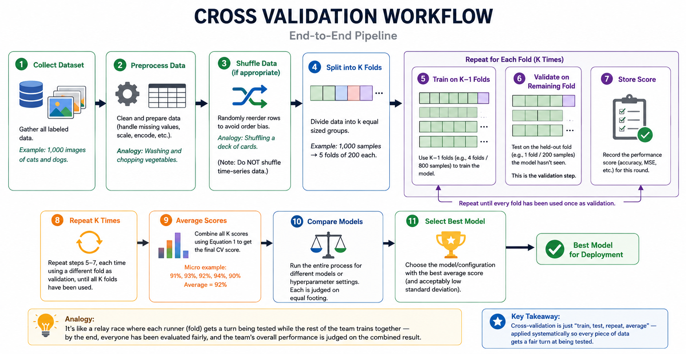

# Cross-Validation Strategies in Machine Learning

**Tagline:** Don't trust one test — trust the average of many.

**What you will learn:** This README explains what cross-validation is, why it matters, and how it works — mathematically, conceptually, and practically — from beginner-friendly analogies to scikit-learn implementation. By the end, you'll understand how to choose the right validation strategy for any dataset, including time-series and imbalanced data, and how this knowledge applies in real interviews and production systems.

---

## 2. What Are Cross-Validation Strategies?

**Why do we need this?**
Imagine you're a teacher trying to judge how well a student understands a subject. If you give them just one exam, the result might be misleading — maybe the exam happened to cover exactly the topics they studied hardest, or maybe they had a bad day. A single exam score doesn't tell you much about their *true* understanding. The same problem exists when we evaluate machine learning models: a single test might give us a falsely good (or bad) impression of how the model will actually perform in the real world.

**What is it?**
In machine learning, we train a model on some data and then test it on other data to see how well it performs. A simple **train/test split** divides the dataset into two parts — one for training, one for testing. This single test is essentially "one exam." If that test portion happens to be unusually easy, unusually hard, or doesn't represent the overall data well, our performance estimate could be misleading. **Cross-validation** is a technique that gives the model multiple "exams" instead of one, and then averages the results to get a more trustworthy picture of how good the model really is.

**How does it work?**
The most common version, **K-Fold Cross-Validation**, splits the data into several equal parts called **folds** (a fold is simply one slice or chunk of the dataset). The model is trained and tested multiple times — each time, a different fold is held back as the "test" portion (called the **validation** set, meaning the part of data used to check performance without being used for training), while the rest of the folds are used for training. Think of it like a factory quality inspector checking products from multiple production batches instead of just one — if every batch passes inspection, you can be far more confident the overall production process is reliable.

**When should we use it?**
Cross-validation is especially valuable when you have limited data, when comparing multiple models, or when tuning settings (called **hyperparameters** — configuration choices for a model, like how many trees a forest model should have, which are set before training begins). It is less critical when you have enormous amounts of data, where even a single split is statistically reliable.

**Why does it matter in practice?**
By averaging results across multiple "exams," cross-validation helps us catch **overfitting** — a situation where a model memorizes the specific training data so well that it performs great on that data but poorly on new, unseen data, much like a student who memorizes exam answers without understanding the concept. Cross-validation also improves **generalization** — the model's ability to perform well on new data it has never seen before — by ensuring the evaluation isn't just a fluke of one lucky or unlucky split.

> **Key Takeaway:** Cross-validation replaces "one exam" with "multiple exams averaged together," giving us a far more honest and reliable picture of how a model will perform in the real world.

---

## 3. Mathematical Formulation

### Equation 1 – Cross-Validation Average Score

```
CV Score = (1/k) Σ Score_i
```

- **CV Score**: the final averaged performance metric across all folds — the single number we report as "how good the model is."
- **k**: the total number of folds the data was split into (e.g., k = 5 means 5 folds).
- **Score_i**: the performance score (accuracy, MSE, etc.) obtained on the *i*-th fold.

**In simple English:** Add up the scores from every fold, then divide by how many folds there are — exactly like calculating the average marks across multiple exams.

**Numerical example:** Suppose we have 100 samples split into 5 folds (20 samples each). The fold accuracies are 91%, 93%, 92%, 94%, and 90%.
```
CV Score = (91 + 93 + 92 + 94 + 90) / 5 = 460 / 5 = 92%
```

**Why it's useful:** A single fold's score might be unusually high or low by chance. Averaging smooths out these "lucky" or "unlucky" results, giving a more stable estimate.

**Relation to Cross-Validation:** This is the core output of the entire cross-validation process — the number you ultimately use to compare models or report performance.

> **Professional Insight:** When reporting CV Score in a project report or resume, also report the standard deviation (Equation 4) alongside it — a score of "92% ± 1.5%" tells a much more complete story than "92%" alone.

---

### Equation 2 – Mean Squared Error

```
MSE = (1/n) Σ (y_i - ŷ_i)^2
```

- **MSE**: Mean Squared Error, a measure of average prediction error for regression problems (problems where the output is a number, like predicting house prices).
- **n**: the number of samples in the dataset (or fold).
- **y_i**: the actual (true) value for sample *i*.
- **ŷ_i** (pronounced "y-hat"): the value the model *predicted* for sample *i*.

**In simple English:** For each sample, find the difference between the true value and the predicted value, square it (so negative and positive errors don't cancel out), and average all these squared differences.

**Numerical example:** Suppose actual house prices are [100, 150, 200] (in thousands) and predicted prices are [110, 140, 190].
```
Errors: (100-110)^2=100, (150-140)^2=100, (200-190)^2=100
MSE = (100+100+100)/3 = 100
```

**Why it's useful:** Squaring the errors penalizes large mistakes more heavily than small ones — useful when big errors are especially costly (e.g., a self-driving car misjudging distance).

**Relation to Cross-Validation:** MSE is commonly computed separately for each fold, then averaged across folds (using Equation 1) to give a final regression performance estimate.

---

### Equation 3 – Classification Accuracy

```
Accuracy = Correct Predictions / Total Predictions
```

- **Correct Predictions**: the number of samples where the model's predicted label matches the true label (e.g., model says "cat," and the image really is a cat).
- **Total Predictions**: the total number of samples evaluated.

**In simple English:** Out of everything the model guessed, what fraction did it get right?

**Numerical example:** Out of 20 samples in a validation fold, the model correctly classified 18.
```
Accuracy = 18 / 20 = 0.90 = 90%
```

**Why it's useful:** It's the most intuitive metric for classification problems — easy to explain to anyone, technical or not.

**Relation to Cross-Validation:** Accuracy is computed separately for each validation fold (using only the samples in that fold), and then these per-fold accuracy values are averaged using Equation 1 to get the final CV accuracy.

> **Common Mistake:** Relying on accuracy alone for **imbalanced datasets** (where one class is much rarer than another, e.g., 95% non-fraud vs. 5% fraud transactions). A model that always predicts "non-fraud" would score 95% accuracy while being completely useless — always check additional metrics like precision, recall, or F1-score in such cases.

---

### Equation 4 – Standard Deviation of Fold Scores

```
σ = √[(1/k) Σ(score_i − μ)^2]
```

- **σ** (sigma): the standard deviation of the fold scores — a measure of how spread out or "wobbly" the scores are.
- **score_i**: the performance score from the *i*-th fold.
- **μ** (mu): the mean (average) score across all folds — calculated using Equation 1.
- **k**: the total number of folds.

**In simple English:** First, find how far each fold's score is from the average, square those differences, average them, then take the square root. The result tells you how "consistent" the model's performance is across different folds.

**Numerical example:** Using our earlier scores [91, 93, 92, 94, 90] with mean μ = 92:
```
Differences from mean: -1, 1, 0, 2, -2
Squared: 1, 1, 0, 4, 4
Average of squares = 10/5 = 2
σ = √2 ≈ 1.41
```

**Why it's useful:** A low σ means the model performs almost the same regardless of which data it sees — a sign of a stable, reliable model. A high σ means the model is sensitive to the specific data it's trained or tested on, which is a warning sign.

**Relation to Cross-Validation:** σ is calculated directly from the fold scores produced during cross-validation, and is often reported alongside the CV Score to give a complete picture of model reliability.

> **Key Takeaway:** A high average score with a high standard deviation is less trustworthy than a slightly lower average with a low standard deviation — consistency matters as much as raw performance.

---

### Equation 5 – Leave-One-Out Cross Validation

```
Number of folds = n
```

- **n**: the total number of samples in the dataset.
- In **LOOCV (Leave-One-Out Cross-Validation)**, each individual sample takes a turn being the validation set exactly once, while all other *n−1* samples are used for training.

**In simple English:** If you have 50 samples, you train the model 50 times — each time leaving out just one sample to test on, and using the remaining 49 to train.

**Numerical example:** With n = 10 samples, LOOCV trains the model 10 separate times, each time validating on a different single sample.

**Advantages:** Uses almost all data for training in each iteration — extremely useful for very small datasets where every data point matters (e.g., rare medical case studies).

**Disadvantages:** Extremely computationally expensive for large datasets, since the model must be trained *n* times. The resulting estimate can also have high variance (it can swing a lot depending on which single sample was excluded).

**Relation to Cross-Validation:** LOOCV is simply K-Fold Cross-Validation taken to its extreme, where k equals n.

---

## 4. How Cross-Validation Works – Step by Step

```
Collect Data
   ↓
Preprocess Data
   ↓
Shuffle (if appropriate)
   ↓
Split into K Folds
   ↓
Train on K−1 Folds
   ↓
Validate on Remaining Fold
   ↓
Store Score
   ↓
Repeat K Times
   ↓
Average Scores
   ↓
Compare Models
   ↓
Select Best Model
```

1. **Collect dataset** – Gather all your labeled data. *Example:* 1,000 images of cats and dogs, each labeled "cat" or "dog."

2. **Preprocess data** – Clean and prepare the data (handle missing values, scale numbers, encode categories). *Analogy:* Washing and chopping vegetables before cooking, so every "batch" of the recipe starts from the same quality ingredients.

3. **Shuffle data (if appropriate)** – Randomly reorder rows so patterns aren't tied to the order the data was collected. **Shuffle** simply means mixing up the order of rows before splitting. *Analogy:* Shuffling a deck of cards before dealing, so no player gets an unfair run of similar cards. *(Note: for time-series data, we do NOT shuffle — explained in Section 5.)*

4. **Split into K folds** – Divide the dataset into k equal-sized groups, say k = 5. *Example:* 1,000 samples → 5 folds of 200 each.

5. **Train on K−1 folds** – Use 4 of the 5 folds (800 samples) to train the model. This is the model's "study material" for this round.

6. **Validate on remaining fold** – Test the trained model on the 1 held-out fold (200 samples) it has never seen — this is the **validation** step, checking how well the model generalizes.

7. **Store score** – Record the performance score (accuracy, MSE, etc.) for this round.

8. **Repeat K times** – Repeat steps 5–7, each time using a different fold as validation, until all 5 folds have served as the test set exactly once.

9. **Average scores** – Combine all 5 recorded scores using Equation 1 to get the final CV score. *Micro example:* Fold accuracies of 91%, 93%, 92%, 94%, 90% average to 92%.

10. **Compare models** – Run this entire process for different models or hyperparameter settings, so each is judged on equal footing.

11. **Select best model** – Choose the model/configuration with the best average score (and an acceptably low standard deviation).

*Analogy:* It's like a relay race where each runner (fold) gets a turn being tested while the rest of the team trains together — by the end, everyone has been evaluated fairly, and the team's overall performance is judged on the combined result.



*Figure: End-to-end Cross Validation Pipeline.*

[Add image from ChatGPT or Internet here]

> **Key Takeaway:** Cross-validation is just "train, test, repeat, average" — applied systematically so every piece of data gets a fair turn at being tested.

---

## 5. Key Assumptions

Before trusting cross-validation results, certain conditions must hold true. Think of these as the "fine print" — if violated, the results can be misleading even though the numbers look fine.

| Assumption | Why It Exists | If Violated | Real-World Consequence |
|---|---|---|---|
| Samples are representative | Ensures folds reflect the true population the model will face in the real world | Folds may misrepresent real data | Misleading performance estimates |
| Data distribution remains consistent | Model is evaluated under conditions similar to deployment | **Distribution shift** (when the data the model sees in production differs from training data) between folds | Model fails in production despite good CV scores |
| Folds are independent | Each fold should provide an unbiased, separate test | Correlated samples (e.g., duplicate or near-duplicate rows) leak info across folds | Overestimated accuracy |
| No data leakage | Training data must not "see" information from test data | **Data leakage** — information from the validation set accidentally influences training (e.g., scaling using the whole dataset before splitting) | Falsely high performance that collapses in production |
| Proper randomization | Avoids systematic bias in fold composition (e.g., all "yes" labels ending up in one fold) | Folds reflect data order rather than true randomness | Biased, inconsistent evaluation |
| Validation data unseen during training | Tests true generalization, not memorization | Model memorizes validation data | Overfitting goes undetected |
| Time order preserved (time-series) | Future data shouldn't be used to predict the past | Random splits mix future information into training | Unrealistic, inflated accuracy that fails when deployed |
| Stratification maintained (imbalanced data) | Keeps class ratios (e.g., 95% / 5%) consistent across folds | Some folds may lack the minority class entirely | Unstable or misleading metrics |

> **Common Mistake:** Performing preprocessing (like scaling or feature selection) on the *entire* dataset before splitting into folds. This leaks statistical information from the validation set into training, inflating performance scores. Always preprocess **inside** each fold, ideally using a `Pipeline`.

> **Key Takeaway:** Cross-validation only gives trustworthy results if the data is handled carefully — shuffled correctly (unless it's time-series), free of leakage, and representative of real-world conditions.

---

## 6. When to Use / When Not to Use

| ✅ When Cross-Validation is Recommended | ❌ When It May Not Be Appropriate |
|---|---|
| Small datasets where every sample counts | Very large datasets where a single split is statistically sufficient |
| Hyperparameter tuning (e.g., GridSearchCV) | Streaming systems with continuously arriving data |
| Comparing multiple models fairly | Real-time online learning where models update instantly |
| Healthcare and medical prediction (high-stakes, low-data scenarios) | Reinforcement learning (where an agent learns through interaction, not fixed datasets) |
| Fraud detection (rare event modeling, needs stratification) | Strict time-series forecasting (random folds break chronological order) |
| Credit scoring (regulatory need for robust, defensible evaluation) | Production systems with strong temporal dependencies |
| NLP and Computer Vision research (comparing architectures fairly) | Massive datasets where retraining k times is computationally infeasible |
| Recommendation systems during offline evaluation | Situations needing immediate, low-latency model updates |
| Academic research requiring statistically sound evaluation | — |

**Trade-off:** Cross-validation gives more reliable estimates but costs more computation — training the model k times instead of once. For huge datasets or time-sensitive systems, this extra cost may outweigh the benefit of a slightly more robust estimate.

> **Industry Practice:** In real production pipelines, cross-validation is most heavily used *during model development and tuning* — once the best model and hyperparameters are chosen, a final model is often trained on the full dataset before deployment.

> **Key Takeaway:** Use cross-validation when reliability matters more than speed; skip or simplify it when data is abundant, time-ordered, or arriving continuously.

---

## 7. Implementation Overview

### Manual Implementation (NumPy)

In a manual approach, you would: create fold boundaries by splitting an array of indices into k roughly equal chunks (**index management** — keeping track of which row numbers belong to which fold), then loop through each chunk — using it as validation indices and the remaining indices for training. Inside the loop, you train your model on the training indices, predict on the validation indices, and compute a score. After the loop, you average all collected scores using Equation 1 (**score averaging**). This manual approach builds strong intuition for *what's actually happening under the hood*, but it's rarely used in production because scikit-learn provides optimized, tested, and far less error-prone tools for the same job.

### Scikit-learn Implementation

- **train_test_split**: Creates a single train/test split, often used to carve out a final **holdout set** (a portion of data kept completely separate, untouched until the very end, for a final unbiased check) before cross-validation begins.
- **KFold**: Splits data into k folds for standard cross-validation.
- **StratifiedKFold**: Like KFold, but preserves class proportions in each fold — essential for imbalanced datasets (e.g., keeping the 95%/5% ratio consistent in every fold).
- **LeaveOneOut**: Implements LOOCV, where each sample is its own validation fold.
- **GroupKFold**: Ensures samples from the same group (e.g., all scans from the same patient) don't appear in both train and validation folds — preventing a sneaky form of data leakage.
- **TimeSeriesSplit**: Creates folds that respect chronological order, preventing future data from leaking into training — critical for forecasting problems.
- **cross_val_score**: Quickly computes scores across folds for a given model and metric — the simplest way to get a CV score.
- **cross_validate**: Like cross_val_score, but returns multiple metrics and timing information in one call.
- **GridSearchCV**: Combines cross-validation with hyperparameter search to automatically find the best model configuration.
- **Pipeline**: Chains preprocessing and modeling steps together so cross-validation applies correctly to the *entire* workflow — the standard defense against data leakage.

```python
from sklearn.datasets import load_iris
from sklearn.model_selection import train_test_split, KFold, cross_val_score
from sklearn.linear_model import LogisticRegression

# Load dataset
X, y = load_iris(return_X_y=True)

# Train-test split (holdout set for final evaluation)
X_train, X_test, y_train, y_test = train_test_split(X, y, test_size=0.2, random_state=42)

# Define KFold cross-validation
kfold = KFold(n_splits=5, shuffle=True, random_state=42)

# Initialize model
model = LogisticRegression(max_iter=200)

# Perform cross-validation
scores = cross_val_score(model, X_train, y_train, cv=kfold, scoring='accuracy')

# Print average accuracy
print("Average CV Accuracy:", scores.mean())
```

> **Professional Insight:** Production systems often use `StratifiedKFold` for imbalanced datasets because preserving class distribution across folds leads to more reliable and reproducible evaluation results.

> **Industry Practice:** `GridSearchCV` combines hyperparameter tuning with cross-validation, automatically training and evaluating many model configurations to select the best one — saving engineers from writing manual tuning loops.

> **Common Mistake:** Using a plain `KFold` (which shuffles randomly) on time-series data. This lets the model "see the future" during training, producing unrealistically high scores. Always use `TimeSeriesSplit` for sequential data.

> **Key Takeaway:** Manual implementation teaches the mechanics; scikit-learn tools make cross-validation fast, reliable, and production-ready.

---

## 8. Top 5 Interview Questions

- **What is Cross-Validation?**
  - Hint: A technique for robust model evaluation using multiple train/test splits instead of one.
  - Hint: Mention that it gives an *average* and a *spread* (standard deviation) of performance.

- **Why is K-Fold better than a single Train-Test split?**
  - Hint: Reduces variance in the performance estimate.
  - Hint: Every sample gets used for both training and validation across the process — better data utilization.
  - *Interview Tip:* If asked this directly, mention "reduced variance" and "better utilization of data" as the two core points.

- **Stratified KFold vs KFold — what's the difference?**
  - Hint: Stratified preserves class distribution in every fold.
  - Hint: Critical for imbalanced datasets (fraud, disease detection).

- **What are the advantages and disadvantages of Leave-One-Out (LOOCV)?**
  - Hint: Advantage — maximum training data per iteration, good for tiny datasets.
  - Hint: Disadvantage — computationally expensive (n model trainings) and high variance.

- **What is TimeSeriesSplit, and why does random splitting fail for sequential data?**
  - Hint: Random splits can place "future" data in the training set, leaking information.
  - Hint: TimeSeriesSplit always trains on past data and validates on future data, mimicking real deployment.

---

## 9. Quick Reference Table

| Item | Detail |
|---|---|
| Definition | A resampling technique to evaluate model performance on multiple data subsets |
| Purpose | Provide a reliable, low-variance estimate of model generalization |
| Input | Dataset (features + labels), a model, and the number of folds (k) |
| Output | Average score, plus variance/standard deviation, across folds |
| Algorithm Type | Model evaluation / resampling technique (not a predictive algorithm itself) |
| Time Complexity | O(k × training time of one model) |
| Space Complexity | O(n) — typically just stores fold indices |
| Variants | K-Fold, Stratified K-Fold, LOOCV, GroupKFold, TimeSeriesSplit |
| Hyperparameters | k (number of folds), shuffle (True/False), random_state (for reproducibility) |
| Evaluation Metrics | Accuracy, MSE, Precision, Recall, F1-score, AUC, etc. |
| Advantages | More reliable performance estimate; reduces overfitting risk; better data utilization |
| Limitations | Computationally expensive; not directly suitable for time-series or extremely large datasets |
| Applications | Model selection, hyperparameter tuning, healthcare/fraud/credit modeling, academic benchmarking |

---

## 10. References & Further Reading

- [Scikit-learn: Cross-validation documentation](https://scikit-learn.org/stable/modules/cross_validation.html)
- Hastie, T., Tibshirani, R., & Friedman, J. — *The Elements of Statistical Learning*
- Géron, A. — *Hands-On Machine Learning with Scikit-Learn, Keras, and TensorFlow*
- Bishop, C. — *Pattern Recognition and Machine Learning*
- [Kaggle: Cross-Validation tutorials and notebooks](https://www.kaggle.com/search?q=cross+validation)
